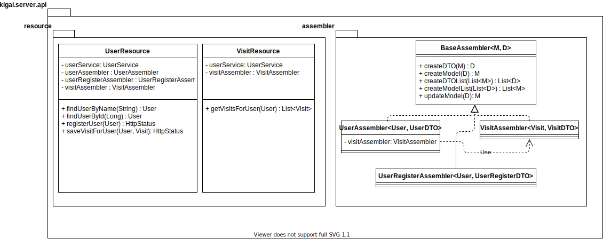

>Software Engineering final project, documentation. Team: Godra Adam, Benedek Balazs

# Introduction

## ikigai

> _(生き甲斐)_  
> _[ikiɡai]_  
> _japanese for a reason to live_

...travelling is ours  
\~ the creators: **Benedek Balazs and Godra Adam**
*for UTCN @2020*

**a scratch-map mobile app made for a university project**

- scratch the countries you visited
- share your thoughts about the places you've seen
- read fellow travellers' notes
- visit the whole world!

## Definition

This application is meant to connect travel-minded people from around the world. Users can share and recommend their travel experiences, as well as keep track of their own travels via a scratch-map like interface.

## Approach

- The system is based on the **client-server architecture**
- The system will be composed of the following components: a responsive web-client, a mobile client for android devices and a server to provide the underlying API allowing communication between the two different clients.
- The backend server will be implemented as a **Java Spring application** following an enterprise architecture comprising a data access layer, a service layer as well as an API layer. For data access a **MySql** database is used, while the API falls into the **RESTful** category. All of this is made possible by the Spring framework.
- Similarly, the android application will be provided with its own local database, in order to allow the user to view his recorded data without internet connection. For this an **ORMLite** implementation is used, and for communication with the server the **Retrofit API** is used.
- The web client utilizes simple `html`, `css` and `JavaScript` code

## Specification

- Upon first entry, the user is greeted with a login/register form. Once registration is successful the user is redirected to the **main page**

### The main page

- The main page is made up of a **large map** of the world.
- There is a button for social interactions such as viewing other people's maps or adding a user as a 'friend'
- There is a button for user settings

* #### The map

- The map is interactive, meaning that each country can be clicked on individually and the map can be zoomed in and out of as well as moved around.
- In case a country is clicked a dialog window is shown prompting the user whether they would like to mark the given country as visited
- An optional 'commentary' field is also provided when marking a country as visited
- Once a country has been visited, it will be colored differently than the unvisited ones

### Social interactions

- When the **social interactions** button is clicked the application navigates to a new page which contains a search field allowing the user for other users by their username.
- If the searched user is found, the user can add them as a **friend** so that next time they no longer have to search for them but simply see them in their list of friends
- The user can also view the searched user's/friend's map displaying his or her visited countries instead of the user's

### Settings

- When the **settings** button is clicked the application navigates to a new page which involves multiple options for the user to customize the application
- These options involve:

1. **Color theme**: look and feel of the application
2. **Public/private profile**: if the user does not desire other users to see their visits, they can turn their profile private
3. **Logout/login as other user**

# Analysis

 
Use case diagram of the system

Deployment diagram of the system

## The domain layer

> The domain layer (model layer) will contain POJOs representing entities participating in the application. They are as follows:

- **User**: Represents the user using the application. Identified by: `id` (a unique identifier used by the relational database) `username`, `email`. Will contain a `list` of **Visit**s (see below)
- **Visit**: Represents a many-to-many relationship between users and visited countries. That is, a user can visit multiple countries and one country could be visited by multiple users. Associated data members are: `date` and a remark which contains a short description of the visit. Countries themselves are represented as `String` as no additional data is associated to them.

## API layer

> Involves identifying the satisfactory and necessary API endpoints to efficiently communicate with the server. Possible use cases:

- register/login/change password for a **User**
- CRUD operations for **Visit**s on the server
- find a user by username, get their **Visit**s

> From which we identify the following endpoints:

- `POST`: `/api/user/register` --register
- `GET`: `/api/user/login` --login
- `PUT`: `/api/user/{id}` --change password
- `POST`: `/api/user/visit/{name}` -- create visit
- `GET`: `/api/visit/{name}` --get all visits of a user
- `GET`: `/api/user/name/{name}` --find user by name

## Data access layer

>  The server will persist registered users, and their visited countries. The database will have the following tables:

- `users` : with the following fields:
    - `id`: a unique identifier
    - `username`: display name on the platform
    - `email`: for contacting the user when needed (e.g. forgotten password)
    - `password`: for authetification purposes. Needless to say it is crucial the password is properly hashed.
    - a `list` of `visits` representing a many-to-many relatiosnhip between the users and the countries they visited

- `visits`: with fields:
  - `id`: integer (a unique identifer)
  - `country`: string (name of the country)
  - `date`: date of visit
  - `description`: string (short description of said visit)
  - `user`: string (name of user)

# Design

## Application layering

> **horizontal slice architecture**: classes are organized by responsibilty rather than by concern

<code>Presentation Layer</code> 
<code>Service Layer</code> 
<code>Domain layer</code> 
<code>Data Acces Layer</code>
 /  \ 
<code>Repo layer | API layer</code>

## Data structures, algorithms, design patterns

### Recommendation system
>**Note:** Not yet implemented, only researched feature.

We attempt to implement a recommendation system based on past preferences of the user. For this we apply an **MDP** (*Markov Decision Process*) based model, in which each state corresponds to a few previously visited countries (only a few, in order to reduce the state space). As a transition function we ought to figure out how likely it is for a given user to visit another country, for which we need a large input sample data (which we do not have, and would require a large amount of time to create our own). Lastly, we need a reward function for each state transition, which would correspond to how satisfied the user is with any given recommendation. From there on, serving a relevant recommendation would be simply to solve the MDP at hand. See [this paper](https://www.jmlr.org/papers/volume6/shani05a/shani05a.pdf) for full information.

### Design patterns

- **Service**:
  - `Dependency injection`: services are single responsibilty classes 'injected' into other classes that require said services
  - `Factory`: the service initialization is delegated to an appropriate factory class => looser coupling
- **UI**:
  - event handling utilizes the `Observer` design pattern
  - `Composition` for complex design elements
- **Data access**:
  - `Singleton` pattern used for database connection; guarantees a single connection instance to the database thorughout the entire application.
  - `DAO pattern` for data acces/querying
  - `DTO pattern` used for data transfer between the server and client: reduce the size of data passed between the server and client to increase throughput, by only storing the bare minimum amount of data in the transfer objects.
  - `Proxy` for lazy loading from/to local database: store data loaded from disk in program memory to avoid hardware access overhead.

  # Implementation

  ## Domain Layer

  > Consits of POJOs representing the entities participant in the application: users, formalized in the `User` class and visits, formalized in the `Visit` class. They together form a many-to-many relationship, with the 'owner' side being a user since visited countries belong to a user, while users don't belong to any country. Both of these classes will inherit from a base class named `BaseModel`, containing a single attribute called `id` which is of type Long and will serve as a unique identifier as well as primary key used by the database for both the `users` and `visits` tables. Finally these classes are placed in the model `ikigai.server.model` package

 
UML model diagram of the model package
 
Code implementation of the BaseModel superclass
 
Code implementation of the User class
 
Code implementation of the Visit class

## Repository Layer

>The bulk of data access boiler plate code is handled automagically by Spring framework's data JPA library. Persisted entities and their columns are marked by annotations and data acces code is generated from it, in the background. For the database implementation, `MySql80` is used for its tested performance and reliability, though something more lightweight such as `MongoDB` could do the job just as well. As far as implementation goes, we simply extend the generic `CrudRepository<M, ID>` interface provided by Spring with the corresponding interfaces, that being `UserRepository<User, Long>` and `VisitRepository<Visit, Long>` add any specific query methods(if needed) and then the rest of the implementation is automatically generated upon the start of the application.

UML class diagram of the repo package
 
Source code of UserRepository. Note that the implementation of these methods is handled by Spring
 
Source code of VisitRepository. CRUD operations are inherited from generic super interface and implemented automatically for the specific types.

## API Layer

> Again, as with the repository layer, the heavy work is passed on to the Spring framework. It comes with a 'built-in' web server, namely Tomcat, which is automatically started with the application, and the web app is automatically deployed to the web server. We only to need to specify the REST API endpoints as functions denoted with the proper annotations, within a class marked as `@RestController`. These controller classes form the `ikigai.server.api.resource` repository. There is another repository within `ikigai.server.api`, the `assembler` package. This package contains classes responsible for the conversion between model and data transfer objects (see above).

 
UserResource source code
 
VisitResource source code

## Service Layer
> The service layer stands as a middle ground in between the API and Repository layers. It serves as yet another level of abstraction and as such decreases tight coupledness (meaning changes in the repository layer will no longer affect the functionality of the API). This package (`ikigai.server.service`) comprises two classes, one for each identified entity, UserService and VisitService. These classes implement data acces as well as any additional functionality more complex than CRUD operations. In the case of UserService such functionality would be to register users(check if eamil and username not taken, hash password, then save in database), or to save a newly visited country for any given user. 

# Further improvements

The application should come armed with a feature to offer personalized recommendations for the user based on his/her preferences in the past(Markov Decision Process based recommendation system) or on the preferences of likeminded users of the platforms(Collaborative Filtering recommendation system).

# Bibliography
[REST Controllers in Java using Spring](https://www.baeldung.com/category/rest/)
[Spring Data JPA](https://www.baeldung.com/the-persistence-layer-with-spring-data-jpa)
[Dependency Injection in Spring](https://www.baeldung.com/inversion-control-and-dependency-injection-in-spring)
[MDP based recommendation system](https://www.jmlr.org/papers/volume6/shani05a/shani05a.pdf)