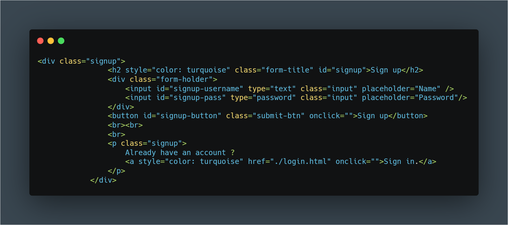
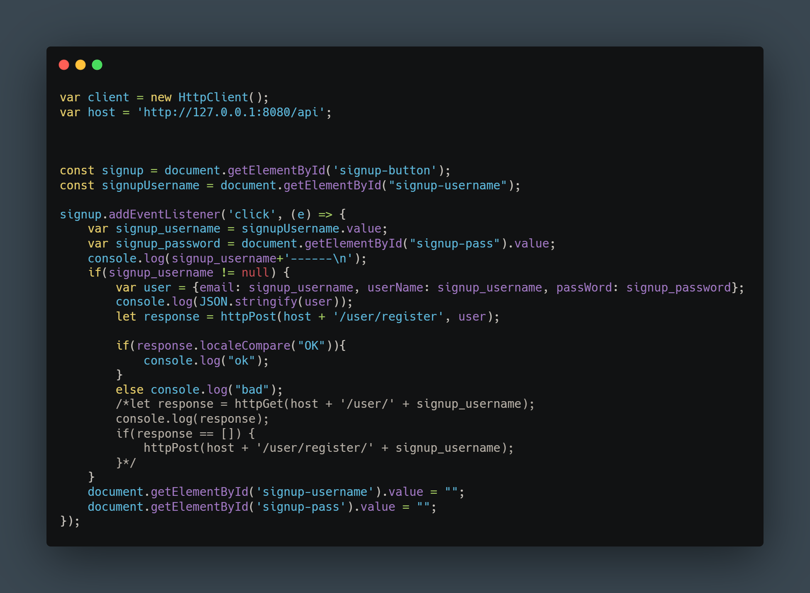
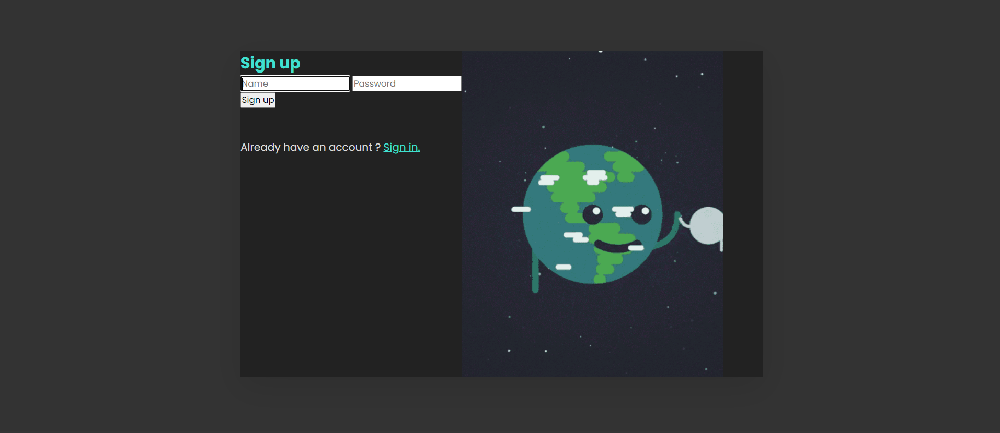
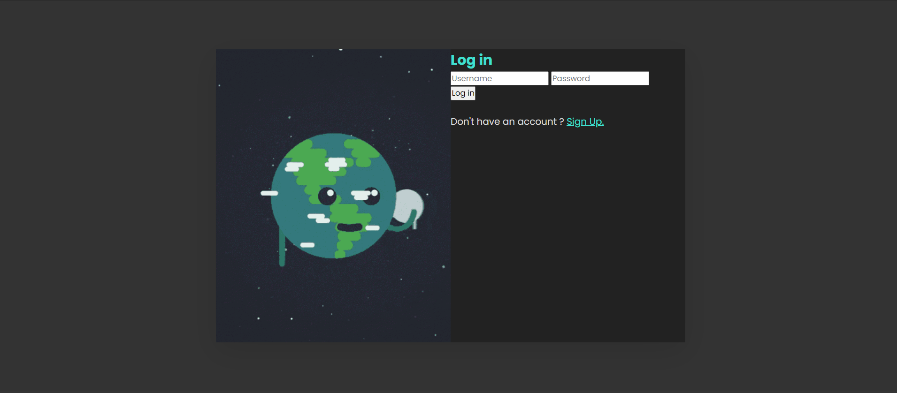
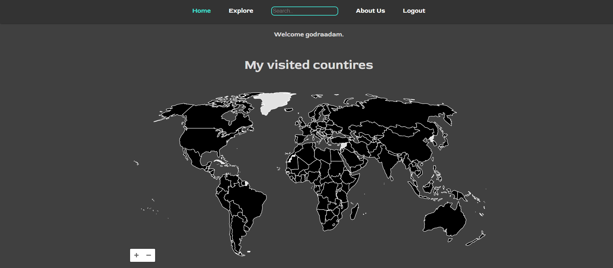
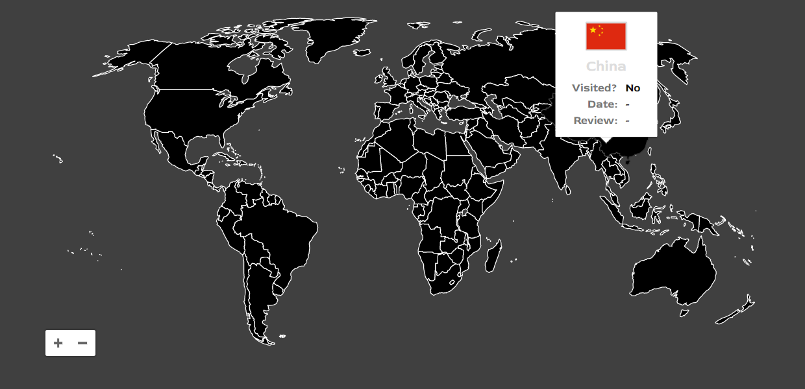

>Software Engineering project, documentation

# FrontEnd

# Structure of Frontend

## HTML, CSS, JavaScript
There are 3 different file types that are used to develop the webpage part of the project, namely .css, .html, and .js.

From the MVC (model view controller) part the frontend is the view part. The RestAPI calls are used to control the webpage. For instance the sign up page checks if the the one who wants to register is an existent user or not, validating the given values if they are correctly written, such as an e-mail, or even the 8 character password, the login page checks it as well, verifying the password too. 

### Sign Up

The html file: 

The javascript file: 

There is no need to attach the css file

## svgMap

svgMap is a JavaScript library that lets you easily create an interactable world map comparing customizable data for each country.

# Appearance

# Further improvements

The application should come armed with a feature to offer personalized recommendations for the user based on his/her preferences in the past(Markov Decision Process based recommendation system) or on the preferences of likeminded users of the platforms(Collaborative Filtering recommendation system).

# Bibliography
[REST Controllers in Java using Spring](https://www.baeldung.com/category/rest/)
[Spring Data JPA](https://www.baeldung.com/the-persistence-layer-with-spring-data-jpa)
[Dependency Injection in Spring](https://www.baeldung.com/inversion-control-and-dependency-injection-in-spring)
[MDP based recommendation system](https://www.jmlr.org/papers/volume6/shani05a/shani05a.pdf)
[World map charts with svgMap by Stephan Wagner] (https://stephanwagner.me/create-world-map-charts-with-svgmap)